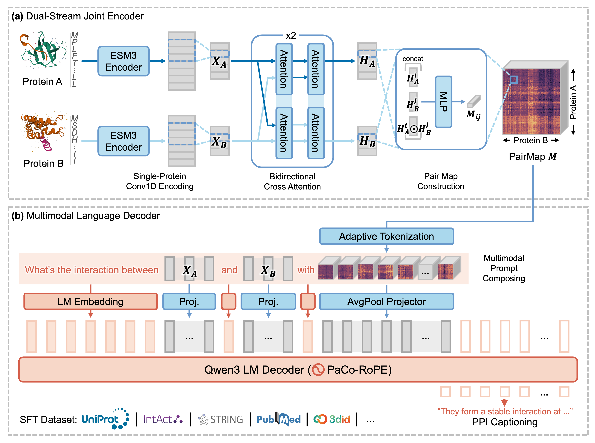
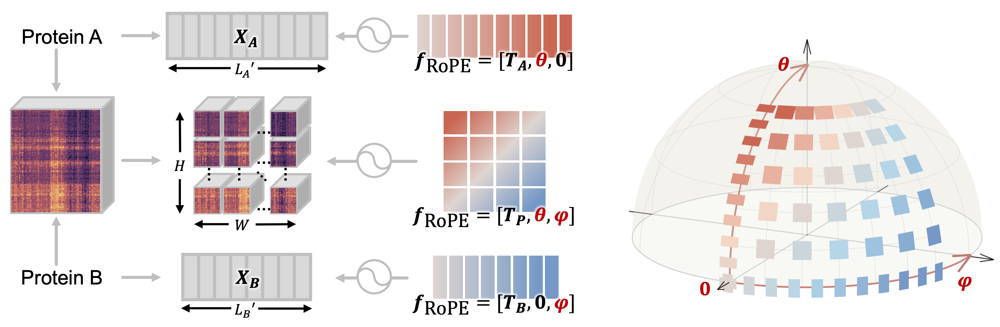

# PPI2Text

This is the repository for the paper "PPI2Text: Captioning Protein-Protein Interactions with Coordinate-Aligned Pair-Map Decoding". 

## Model Architecture



## Pair-Coordinated Rotary Positional Encoding (PaCo-RoPE)



## Environment Installation

Installation verified on Ubuntu-22.04-LTS with NVIDIA GPUs.

Run `nvidia-smi` to check the proper installation of NVIDIA driver (version >= 525 recommended). If not installed:

```bash
sudo ubuntu-drivers install        # list compatible drivers
sudo apt install nvidia-driver-550 && sudo reboot
```

Then proceed:

```bash
sudo apt install dssp=4.0.4-1      # used by datapipe/4_calculate_ss8.py

conda create -n ppi2text python=3.12 -y
conda activate ppi2text
pip3 install -r ./requirements.txt --no-deps
```

You may see a warning from pip's dependency resolver such as:

```
esm 3.2.3 requires transformers<4.48.2, but you have transformers 5.2.0 which is incompatible.
```

In practice, this does not cause any issue and the warning can be ignored unless an error related to both `esm` and `transformers` is encountered during execution.


## Data Preparation

The dataset is released in Parquet format with two columns:

| Column     | Type   | Description                                                |
|------------|--------|------------------------------------------------------------|
| `pair_id`  | string | `<acc_a>_<acc_b>`, where each side is a UniProt accession. |
| `response` | string | Free-text description of the interaction (target).         |

The training script reads the parquet directly via `--train_data_path` (Parquet and JSONL inputs are auto-detected from the file extension). What still needs preparing are the per-protein ESM3 inputs. The `datapipe/` pipeline downloads AlphaFold structures, computes SASA + SS8, pre-encodes with ESM3, and pre-computes ESM3 embeddings.


The data preprocessing pipeline chains:

1. `derive_accessions_from_parquet.py` — parquet → unique accession list.
2. `fetch_uniprot_sequences.py` — accessions → sequences JSONL via UniProt REST.
3. `21_calculate_sasa.py` — accessions → SASA NPZ (downloads AlphaFold PDBs on the fly).
4. `22_calculate_ss8.py` — PDBs → SS8 NPZ via DSSP.
5. `23_preencode_esm3.py` — sequences + SASA + SS8 + PDBs → per-protein `esm3enc_<acc>.pt`.
6. `24_embed_esm3.py` — encoded tokens → per-protein `esm3emb_<acc>.pt` (used by training via `--read_emb_dir`).

You will also need the pretrained weights for ESM3 (`esm3-sm-open-v1`) and Qwen3 (`Qwen3-4B-Instruct-2507` or `Qwen3-8B`). Download them once and pass the local paths to the training and generation scripts.


## Training

Multi-GPU LoRA fine-tuning, end-to-end:

```bash
python -m torch.distributed.launch --nproc_per_node=4 --nnodes=1 \
    -m scripts.train \
    --train_data_path /path/to/ppi2text_dataset.parquet \
    --val_data_path   /path/to/ppi2text_dataset.parquet \
    --read_emb_dir    /path/to/esm3_embedded \
    --qwen_path       /path/to/Qwen3-4B-Instruct-2507 \
    --save_checkpoint_dir ./checkpoints \
    --torch_dtype bfloat16 \
    --batch_size_per_device 2 \
    --num_epochs 3 \
    --learning_rate_lora 1e-4 \
    --learning_rate_from_scratch 5e-5 \
    --scheduler_warmup_steps 1000 \
    --scheduler_gamma 0.99949 \
    --lora_rank 16 \
    --max_seq_len 2040
```

## Inference

```bash
python -m scripts.generate \
    --generate_data_path /path/to/ppi2text_dataset.parquet \
    --read_emb_dir       /path/to/esm3_embedded \
    --qwen_path          /path/to/Qwen3-4B-Instruct-2507 \
    --load_adapter_checkpoint_dir ./checkpoints/<run>/<step> \
    --save_generation_dir ./generations \
    --torch_dtype bfloat16 \
    --batch_size_per_device 1 \
    --max_new_tokens 512
```

## Benchmarking

Compute BLEU / ROUGE / BERTScore on the generated outputs:

```bash
python -m scripts.benchmark \
    --read_generation_dir ./generations \
    --read_file_identifier <postfix-or-timestamp> \
    --evaluate_exact_match True \
    --evaluate_bleu True \
    --evaluate_rouge True \
    --evaluate_bert_score True \
    --verbose True
```

